Berlin Crime Analysis
================

## Introduction

Berlin is the capital of Germany and the country’s largest city. With
almost four million residents, it is also the most populous city in the
European Union. Berlin is comprised of twelve districts, namely:
Spandau, Charlottenburg-Wilmersdorf, Reinickendorf, Pankow, Mitte,
Friedrichshain-Kreuzberg, Steglitz-Zehlendorf, Tempelhof-Schöneberg,
Neukölln, Lichtenberg, Marzahn-Hellersdorf, and Treptow-Köpenick. Thanks
to a user on Kaggle, I had the opportunity to study the crime data from
the city of Berlin and its districts for the years of 2012 to 2019.

On the whole, I examined the data on a year-to-year basis, rather than
the entire seven-year period, so that years with higher numbers would
not bias the results. However, I did use data for the complete span for
particular calculations. In addition, due to the rather long names of
Berlin’s districts, I chose to shorten some names in certain instances.
For example, “Charlottenburg-Wilmersdorf” is listed as “Charlottenburg,”
even though the figures encompass the entire district (i.e., both
Charlottenburg and Wilmersdorf).

### Dataset source (.csv):

#### <https://www.kaggle.com/danilzyryanov/crime-in-berlin-2012-2019>

### Import .csv file

| Year | District |  Code | Location          | Robbery | Street\_robbery | Injury | Agg\_assault | Threat | Theft | Car | From\_car | Bike | Burglary | Fire | Arson | Damage | Graffiti | Drugs | Local |
|-----:|:---------|------:|:------------------|--------:|----------------:|-------:|-------------:|-------:|------:|----:|----------:|-----:|---------:|-----:|------:|-------:|---------:|------:|------:|
| 2012 | Mitte    | 10111 | Tiergarten Süd    |      70 |              46 |    586 |          194 |    118 |  2263 |  18 |       328 |  120 |       68 |   16 |     4 |    273 |       26 |   171 |  1032 |
| 2012 | Mitte    | 10112 | Regierungsviertel |      65 |              29 |    474 |          123 |    142 |  3203 |  10 |       307 |  170 |       37 |   10 |     4 |    380 |      124 |    98 |   870 |
| 2012 | Mitte    | 10113 | Alexanderplatz    |     242 |             136 |   1541 |          454 |    304 |  8988 |  81 |       792 |  822 |      275 |   49 |    27 |   1538 |      522 |   435 |  3108 |
| 2012 | Mitte    | 10114 | Brunnenstraße Süd |      52 |              25 |    254 |           60 |     66 |  1916 |  86 |       192 |  396 |      131 |   14 |     5 |    428 |      122 |   213 |   752 |
| 2012 | Mitte    | 10221 | Moabit West       |     130 |              51 |    629 |          185 |    199 |  2470 |  94 |       410 |  325 |      161 |   42 |    22 |    516 |       64 |   259 |  1403 |
| 2012 | Mitte    | 10222 | Moabit Ost        |      89 |              45 |    549 |          147 |    204 |  2290 |  63 |       353 |  337 |       90 |   33 |    10 |    392 |       52 |   416 |  1212 |

## Preprocessing

Before conducting my full analysis, I decided to add a column to the
dataset that indicates the total number of crimes committed in the area
specified in a given row. The “Local” variable was not included in this
calculation, since it only serves to specify the number of crimes that
were committed in the same vicinity as the perpetrator’s place of
residence, rather than list any crimes that were not included elsewhere
in the dataset.

| Year | District |  Code | Location          | Robbery | Street\_robbery | Injury | Agg\_assault | Threat | Theft | Car | From\_car | Bike | Burglary | Fire | Arson | Damage | Graffiti | Drugs | Local | Total |
|-----:|:---------|------:|:------------------|--------:|----------------:|-------:|-------------:|-------:|------:|----:|----------:|-----:|---------:|-----:|------:|-------:|---------:|------:|------:|------:|
| 2012 | Mitte    | 10111 | Tiergarten Süd    |      70 |              46 |    586 |          194 |    118 |  2263 |  18 |       328 |  120 |       68 |   16 |     4 |    273 |       26 |   171 |  1032 |  4301 |
| 2012 | Mitte    | 10112 | Regierungsviertel |      65 |              29 |    474 |          123 |    142 |  3203 |  10 |       307 |  170 |       37 |   10 |     4 |    380 |      124 |    98 |   870 |  5176 |
| 2012 | Mitte    | 10113 | Alexanderplatz    |     242 |             136 |   1541 |          454 |    304 |  8988 |  81 |       792 |  822 |      275 |   49 |    27 |   1538 |      522 |   435 |  3108 | 16206 |
| 2012 | Mitte    | 10114 | Brunnenstraße Süd |      52 |              25 |    254 |           60 |     66 |  1916 |  86 |       192 |  396 |      131 |   14 |     5 |    428 |      122 |   213 |   752 |  3960 |
| 2012 | Mitte    | 10221 | Moabit West       |     130 |              51 |    629 |          185 |    199 |  2470 |  94 |       410 |  325 |      161 |   42 |    22 |    516 |       64 |   259 |  1403 |  5557 |
| 2012 | Mitte    | 10222 | Moabit Ost        |      89 |              45 |    549 |          147 |    204 |  2290 |  63 |       353 |  337 |       90 |   33 |    10 |    392 |       52 |   416 |  1212 |  5070 |

## Analysis on Single Variables

### Categorical Variable: Geographical Location (2012)

In order to gain a better perspective on crime trends in Berlin, one can
group the city’s twelve districts by direction (north, south, east,
west, and central Berlin). Using the data from 2012 as an example, the
new categories can be displayed in the form of a bar plot.

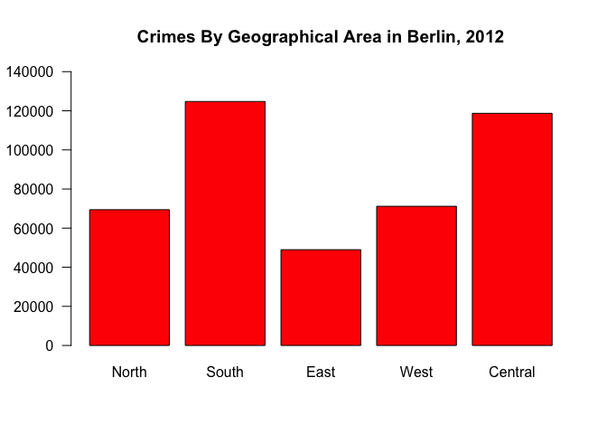<!-- -->

From the bar plot, it is clear that the largest number of crimes in 2012
were committed in south and central Berlin, totaling approximately
125,000 and 120,000 incidents, respectively. Given that these categories
include downtown Berlin and the more populous southern districts, it
would make sense that more crimes were reported in those areas.

An examination of individual districts can provide a more nuanced
understanding of where crimes were committed in 2012. The central
district of Mitte serves as an excellent example, and the corresponding
data can be perhaps best shown as a pie chart.

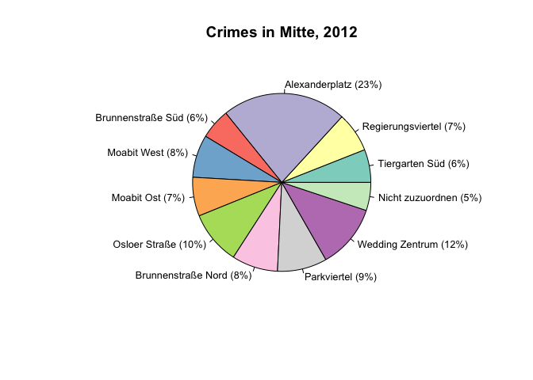<!-- -->

Here, each area in the district appears as a proportion of the total
number of crimes committed in Mitte that year. Once again, the
distribution concurs with a general knowledge of the city:
Alexanderplatz features one of the busiest transit stations in Berlin,
as well as several major landmarks, so it should not come as a surprise
that more crimes occurred there. In fact, the crimes in Alexanderplatz
comprised almost a quarter (23%) of all incidents in the district that
year.

### Numerical Variable: Robbery (2015)

In addition to location, one can analyze the different types of crimes
that occurred in Berlin, such as robbery. In this dataset, the variable
“Robbery” is distinct from “Street\_robbery”.

    ## [1] "The total number of robberies in Berlin in 2015 was 5,318."

    ## [1] "The mean number of robberies committed in any given area of Berlin in 2015 was 35."

    ## [1] "The median number of robberies committed in any given area of Berlin in 2015 was 22."

    ## [1] "The maximum number of robberies reported for one area in 2015 was 196, in Frankfurter Allee Süd FK in Friedrichshain-Kreuzberg."

    ## [1] "The standard deviation for the number of robberies in Berlin in 2015 was 38.81."

In 2015, there were approximately 5,300 robberies in Berlin, with an
average of 35 robberies in any one area. The area around Frankfurter
Allee Süd (Frankfurt Boulevard South) in the central district of
Friedrichshain-Kreuzberg saw the highest number of crimes (196) that
year.

The following box plot confirms these and other statistics, with the
median appearing roughly half-way between 0 and 50 and the furthest
outlier at just below 200.

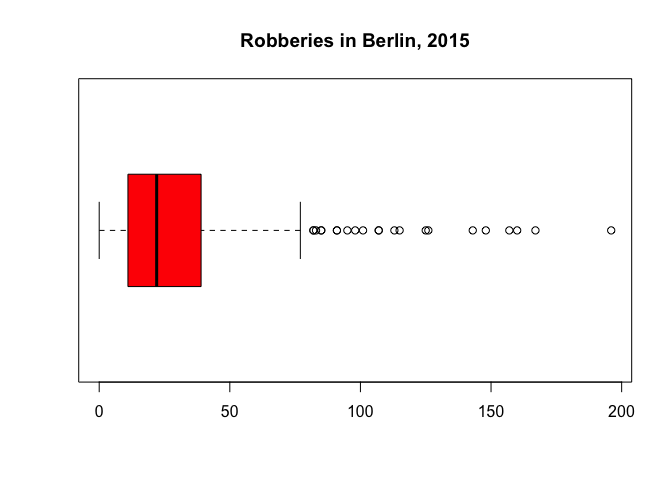<!-- -->

One can also view the number of robberies per district in 2015, as
displayed in the following bar plot.

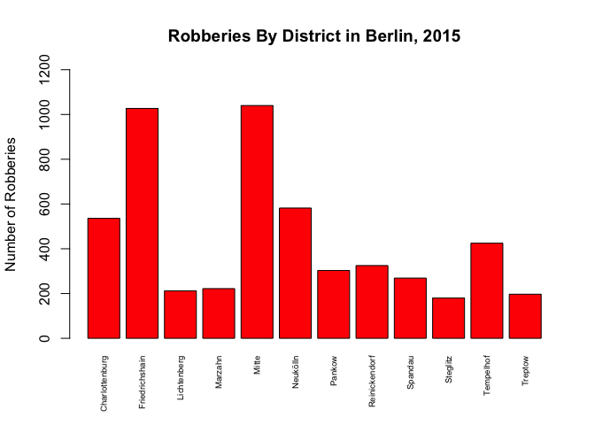<!-- -->

Friedrichshain-Kreuzberg and Mitte clearly surpassed the other districts
in terms of robberies in 2015, with over 1,000 committed in each. The
fewest robberies (under 200) were reported in Steglitz-Zehlendorf,
located in the southwestern portion of Berlin.

## Analysis on Sets of Variables

### Set: Street\_robbery and Agg\_assault (2018)

I studied in Berlin in 2019, and it might have been helpful to know the
numbers of street robberies and aggravated assaults, for example, in
Berlin the previous year. These data can be visualized with a scatter
plot.

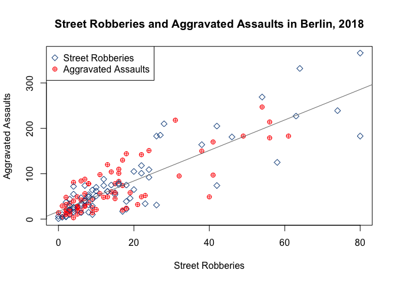<!-- -->

The correlation between street robberies and aggravated assaults in
Berlin in 2018 was both linear and positive, meaning that street
robberies increased as aggravated assaults increased. That being said,
the relationship between the two became weaker as the numbers grew
larger.

    ## [1] "The highest number of street robberies reported for one area in 2018 was 80, in Alexanderplatz in Mitte."                         
    ## [2] "The highest number of street robberies reported for one area in 2018 was 80, in südliche Luisenstadt in Friedrichshain-Kreuzberg."

    ## [1] "The highest number of aggravated assaults reported for one area in 2018 was 366, in Alexanderplatz in Mitte."

    ## [1] "The lowest (non-zero) number of street robberies reported for one area in 2018 was 1, in Schmargendorf in Charlottenburg-Wilmersdorf."
    ## [2] "The lowest (non-zero) number of street robberies reported for one area in 2018 was 1, in Grünau in Treptow-Köpenick."                 
    ## [3] "The lowest (non-zero) number of street robberies reported for one area in 2018 was 1, in Altstadt-Kietz in Treptow-Köpenick."         
    ## [4] "The lowest (non-zero) number of street robberies reported for one area in 2018 was 1, in Müggelheim in Treptow-Köpenick."

    ## [1] "The lowest (non-zero) number of aggravated assaults reported for one area in 2018 was 1, in Schmöckwitz/Karolinenhof/Rauchfangswerder in Treptow-Köpenick."

Comparing the data, one may observe that the highest number of street
robberies and aggravated assaults in 2018 occurred in Alexanderplatz in
Mitte. The same amount of street robberies were reported in a
neighborhood in Friedrichshain-Kreuzberg, as well. Other neighborhoods
in Friedrichshain-Kreuzberg and Treptow-Köpenick had only one instance
of street robbery and the Schmöckwitz area in Treptow-Köpenick reported
a single case of aggravated assault that year. Districts that reported
none of either crime were not included, because, in my opinion, it is
more useful to compare districts that had at least one incident of the
two types of crime. Moreover, the absence of crimes reported might be
the result of an error or other issue in the data collection process.

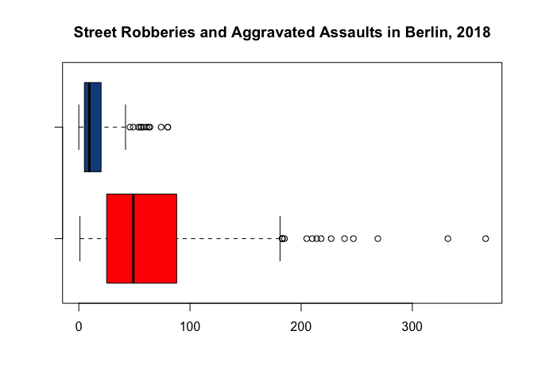<!-- -->

As displayed in the box plots, the range and spread of aggravated
assault data are much broader than those for street robberies, and the
five-number summaries affirm these observations.

    ##    Min. 1st Qu.  Median    Mean 3rd Qu.    Max. 
    ##    0.00    5.00    9.50   16.11   19.75   80.00

    ##    Min. 1st Qu.  Median    Mean 3rd Qu.    Max. 
    ##    1.00   25.00   49.00   71.04   88.00  366.00

If one were to examine a bar plot of the street robberies and aggravated
assaults that took place in 2018, the largest numbers were recorded in
the downtown districts of Mitte and Friedrichshain-Kreuzberg.

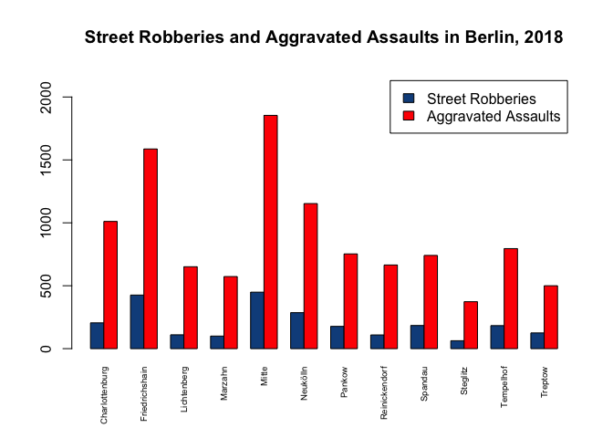<!-- -->

After Mitte and Friedrichshain-Kreuzberg, Neukölln and
Charlottenburg-Wilmersdorf saw the most cases of aggravated assault that
year.

During my time in Berlin, I lived with a host family in Lichtenrade, a
neighborhood in the Tempelhof-Schöneberg district. If I had wanted to
know about crime there, a district-level analysis would have likely
provided the most relevant information.

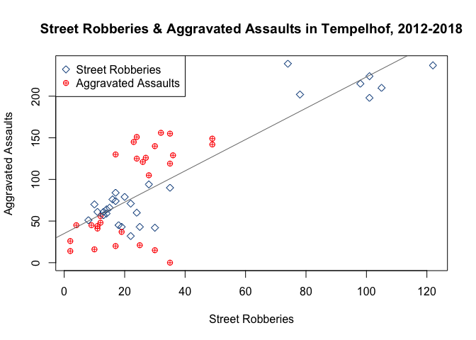<!-- -->

Although the correlation between street robberies and aggravated
assaults in 2018 resembled that of Berlin in general, it was not quite
as tightly packed as the city-wide plot, and the two variables appeared
in clusters with significant gaps, rather than being evenly distributed
across the trend line.

Data from a single year may not fully capture the extent of criminal
activity in a given area, and so it is important to consider a span of
several years, which is depicted in the following bar plot, organized by
each neighborhood in Tempelhof-Schöneberg.

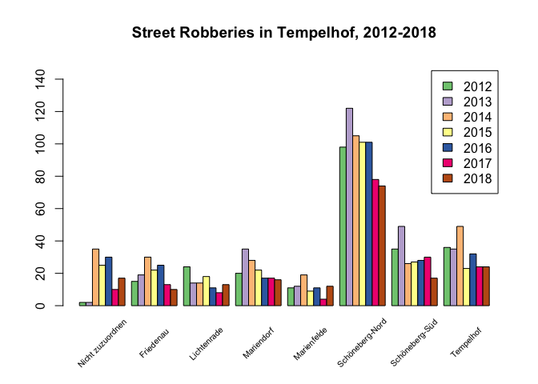<!-- -->

Between 2012 and 2018, there was a general decline in street robberies
across all neighborhoods in the district. Schöneberg-Nord—the
northernmost area, which borders Mitte—still had significantly higher
numbers throughout the seven-year period, and yet there was a relatively
drastic decline in 2017, which continued into 2018. The neighborhood in
which I lived, Lichtenrade, consistently saw few instances of street
robberies. There was a slight increase in 2018, but the total remained
under 20 incidents for the year.

    ## [1] "The rate of street robberies per 1,000 residents in Lichtenrade in 2018 was 0.25%."

Indeed, the rate of street robberies per 1,000 residents in 2018 was
0.25%. In short, if I had examined these data before flying to Berlin, I
would have felt reassured that I would be living in a safe area, and my
personal experience supported that conclusion.

### Set: All crimes (2015-2019)

One can similarly compare the totals of each type of crime, by year, in
Berlin from 2015 to 2019. For the purpose of visualization, the variable
“Theft” is not included, since it is too large to effectively compare
with other variables in the same plot.

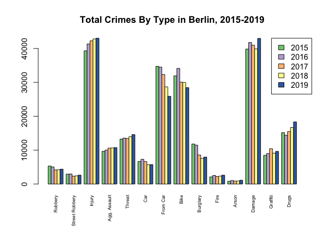<!-- -->

According to the plot, the number of crimes such as robbery, theft from
cars, and burglary generally declined, whereas injury, property damage,
and illegal drugs increased over the five-year span. Street robberies,
fire, and arson remained relatively constant throughout this period.

## Distribution of Numerical Variable: Theft

The variable “Theft” refers to larceny that is classified neither as the
theft of bicycles or cars (or theft from cars) nor as burglary. Due at
least in part to this rather broad description, “Theft” is the largest
variable in the entire dataset.

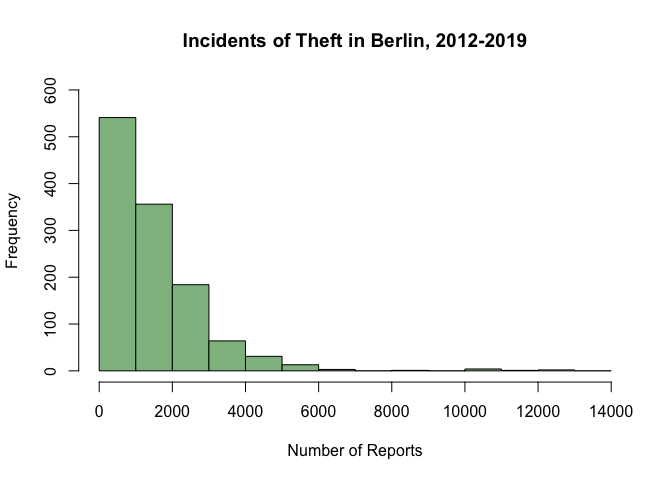<!-- -->

A histogram of thefts in Berlin from 2012 to 2019 suggests an
exponential distribution that is skewed to the right.

    ## [1] "The mean of 'Theft' is 1492.307500."

    ## [1] "The standard deviation of 'Theft' is 1364.442501."

Looking at the overall dataset, the mean is approximately 1,492—meaning
that almost 1,500 thefts occurred in any neighborhood in Berlin in a
given year between 2012 and 2019.

## Random Sampling with the Central Limit Theorem

The calculation of statistics such as the mean and standard deviation
for the theft data involves processing over two thousand elements in the
dataset. In other contexts, the dataset could be much larger, or data
regarding the entire population might not even be available. However,
the Central Limit Theorem (CLT) provides statisticians with a way to
approximate the mean and distribution of the population, even if the
population mean is unknown. This is because, according to the CLT, as
the sample size becomes larger, the distribution of sample means of that
size for the population will increasingly conform to the shape of a
normal distribution, which in turn allows for the use of statistical
techniques that assume the data to be normal.

    ## Orig.Distribution  Mean =  1492.307  SD =  1364.443 
    ## Sample Size =  10  Mean =  1496.105  SD =  438.6221

    ## Sample Size =  20  Mean =  1478.632  SD =  279.0601

    ## Sample Size =  30  Mean =  1477.473  SD =  226.6424

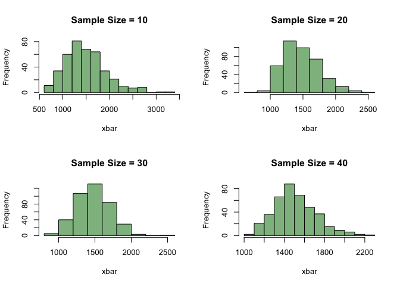<!-- -->

    ## Sample Size =  40  Mean =  1506.281  SD =  211.1616

Using the theft data, one might observe that random samples of sizes 10,
20, 30, and 40 have a similar mean to that of the original distribution,
while the standard deviations decrease as the sample size becomes
larger. Furthermore, it is clear from the four plots that with a larger
sample size, the distribution does indeed appear to be more normal and
centered around the mean.

## Sampling Methods

### Method: Simple Random Sampling Without Replacement

There are several different ways of drawing random, probability-based
samples, such as simple random sampling. In this type of sampling, every
element in the population (in this case, the whole dataset) has the same
likelihood of being selected. Additionally, simple random sampling can
be conducted so that each element is only selected once (i.e., there is
no replacement), which typically yields more accurate results. By
conducting simple random sampling, the proportions of districts
represented in the sample are as follows:

    ## 
    ## Charlottenburg-Wilmersdorf   Friedrichshain-Kreuzberg 
    ##                          5                          6 
    ##                Lichtenberg        Marzahn-Hellersdorf 
    ##                          2                          6 
    ##                      Mitte                   Neukölln 
    ##                          5                          2 
    ##                     Pankow              Reinickendorf 
    ##                          4                          5 
    ##                    Spandau        Steglitz-Zehlendorf 
    ##                          5                          3 
    ##       Tempelhof-Schöneberg           Treptow-Köpenick 
    ##                          2                          5

    ## 
    ## Charlottenburg-Wilmersdorf   Friedrichshain-Kreuzberg 
    ##                       0.10                       0.12 
    ##                Lichtenberg        Marzahn-Hellersdorf 
    ##                       0.04                       0.12 
    ##                      Mitte                   Neukölln 
    ##                       0.10                       0.04 
    ##                     Pankow              Reinickendorf 
    ##                       0.08                       0.10 
    ##                    Spandau        Steglitz-Zehlendorf 
    ##                       0.10                       0.06 
    ##       Tempelhof-Schöneberg           Treptow-Köpenick 
    ##                       0.04                       0.10

### Method: Systematic Sampling

Another form of random sampling is known as systematic sampling, in
which the population is divided into groups and elements are selected at
a randomly designated interval. (Here, this interval is assigned to the
variable “k”.) The proportions of districts represented in the sample
drawn through systematic sampling is shown below:

    ## 
    ## Charlottenburg-Wilmersdorf   Friedrichshain-Kreuzberg 
    ##                          6                          4 
    ##                Lichtenberg        Marzahn-Hellersdorf 
    ##                          6                          2 
    ##                      Mitte                   Neukölln 
    ##                          2                          4 
    ##                     Pankow              Reinickendorf 
    ##                          6                          4 
    ##                    Spandau        Steglitz-Zehlendorf 
    ##                          2                          4 
    ##       Tempelhof-Schöneberg           Treptow-Köpenick 
    ##                          2                          8

    ## 
    ## Charlottenburg-Wilmersdorf   Friedrichshain-Kreuzberg 
    ##                       0.12                       0.08 
    ##                Lichtenberg        Marzahn-Hellersdorf 
    ##                       0.12                       0.04 
    ##                      Mitte                   Neukölln 
    ##                       0.04                       0.08 
    ##                     Pankow              Reinickendorf 
    ##                       0.12                       0.08 
    ##                    Spandau        Steglitz-Zehlendorf 
    ##                       0.04                       0.08 
    ##       Tempelhof-Schöneberg           Treptow-Köpenick 
    ##                       0.04                       0.16

### Method: Inclusion Probabilities

While both simple random sampling and systematic sampling use equal
probabilities of selection, the latter can also be performed with
unequal probabilities, which can be calculated according to another
variable. In this analysis, the “Theft” variable is used to calculate
the probabilities (also known as inclusion probabilities), and the
distribution of districts in the sample is thus:

    ## 
    ## Charlottenburg-Wilmersdorf   Friedrichshain-Kreuzberg 
    ##                          6                          6 
    ##                Lichtenberg        Marzahn-Hellersdorf 
    ##                          2                          3 
    ##                      Mitte                   Neukölln 
    ##                         11                          5 
    ##                     Pankow              Reinickendorf 
    ##                          4                          2 
    ##                    Spandau        Steglitz-Zehlendorf 
    ##                          3                          3 
    ##       Tempelhof-Schöneberg           Treptow-Köpenick 
    ##                          3                          2

    ## 
    ## Charlottenburg-Wilmersdorf   Friedrichshain-Kreuzberg 
    ##                       0.12                       0.12 
    ##                Lichtenberg        Marzahn-Hellersdorf 
    ##                       0.04                       0.06 
    ##                      Mitte                   Neukölln 
    ##                       0.22                       0.10 
    ##                     Pankow              Reinickendorf 
    ##                       0.08                       0.04 
    ##                    Spandau        Steglitz-Zehlendorf 
    ##                       0.06                       0.06 
    ##       Tempelhof-Schöneberg           Treptow-Köpenick 
    ##                       0.06                       0.04

### Method: Stratified Sampling

In a somewhat similar way to the systematic method, stratified sampling
organizes items in a population into subgroups (or strata) according to
a common characteristic, so that the groups might be better represented
in the samples. For this sample, items are grouped by districts,
producing the following proportions:

    ## 
    ## Charlottenburg-Wilmersdorf   Friedrichshain-Kreuzberg 
    ##                          6                          3 
    ##                Lichtenberg        Marzahn-Hellersdorf 
    ##                          5                          3 
    ##                      Mitte                   Neukölln 
    ##                          4                          4 
    ##                     Pankow              Reinickendorf 
    ##                          6                          4 
    ##                    Spandau        Steglitz-Zehlendorf 
    ##                          3                          3 
    ##       Tempelhof-Schöneberg           Treptow-Köpenick 
    ##                          3                          7

    ## 
    ## Charlottenburg-Wilmersdorf   Friedrichshain-Kreuzberg 
    ##                      0.118                      0.059 
    ##                Lichtenberg        Marzahn-Hellersdorf 
    ##                      0.098                      0.059 
    ##                      Mitte                   Neukölln 
    ##                      0.078                      0.078 
    ##                     Pankow              Reinickendorf 
    ##                      0.118                      0.078 
    ##                    Spandau        Steglitz-Zehlendorf 
    ##                      0.059                      0.059 
    ##       Tempelhof-Schöneberg           Treptow-Köpenick 
    ##                      0.059                      0.137

Having performed these different types of random sampling, one can
compare the mean of the “Theft” variable in each sample with that of the
original.

    ## [1] "Original Distribution        Mean: 1492"
    ## [1] "Method: SRSWOR               Mean: 1591"
    ## [1] "Method: Systematic           Mean: 1366"
    ## [1] "Method: Inclusion Probs      Mean: 2378"
    ## [1] "Method: Stratified           Mean: 1342"

Generally speaking, the various sampling methods produced samples that
roughly approximated the mean of the original distribution (the
population)—with the exception of systematic sampling with inclusion
probabilities, which resulted in a mean that was much greater than that
of the population. This outcome is consistent with the population data:
If the proportions were based on the number of thefts, areas with higher
rates would be better represented, consequently biasing the mean of the
sample. Therefore, the other methods should be used to produce more
accurate representations of the total population.

## Visualization of Total Crimes as Heatmap

I also created a heatmap of district crime totals in Berlin from 2012 to
2019, scaled by rows. Heatmaps serve as a straightforward, color-coded
method to visually identify high volumes of a certain variable, such as
the number of crimes in a particular area over time, as shown below.

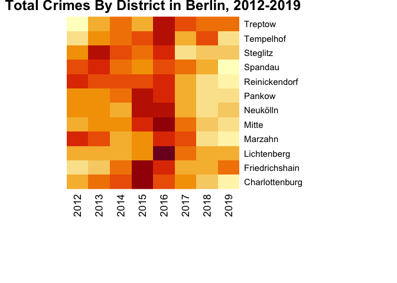<!-- -->

One may make two key inferences from this plot: First, the colors darken
dramatically in 2015 and 2016, thus indicating a spike in crime across
all districts. This was particularly the case in Lichtenberg, as well as
Mitte. One might also observe that the colors generally brighten after
2016, meaning that crime levels decreased relative to those seen in the
previous years. Perhaps in the coming years, further research could be
conducted comparing these data with crime levels in 2020 and 2021, in
order to determine whether the downward trend continued after 2019.

## Conclusion

Berlin is well known within Germany and in the broader European Union
for its unique social, cultural, and linguistic landscape, and the data
regarding crimes committed in the city are equally diverse. By
investigating the distributions of different crimes and of the districts
over time, one may better understand the complexities of maintaining
public safety in such a metropolis, and also appreciate the importance
of statistical analysis in law enforcement, among other fields.
